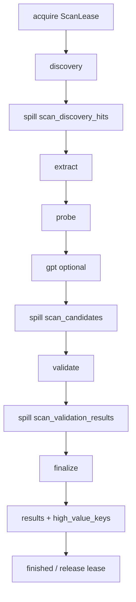

# 扫描流水线

涉及：[aipocket-services](../../crates/aipocket-services/README.md)、[discovery](../../crates/aipocket-discovery/README.md)、[prober](../../crates/aipocket-prober/README.md)、[clients](../../crates/aipocket-clients/README.md)。

入口：`Scanner::run_inner`。Web 侧由 `ScanManager` 接 `ScanEvent`，再投影到 `/api/scan/status` 与 SSE。

`runs.phase` 使用 `PipelinePhase`（[ADR-002](../../dev/decisions/002-pipeline-phase-spill.md)）顺序，表示**最后一个已完成且 spill 已落库的阶段**：

`started → discovery → extract → probe → gpt → validate → finalize → finished`

有 PostgreSQL 时，每个发现源返回后立即写入 `scan_discovery_hits` 并丢弃 banner；extract / probe / gpt 按页读取。`ScanEvent::Phase` 使用同一组名字（不再写 `extract_validate`）。旧中断 run 若 `phase=validate` 但候选表为空、hits 非空，resume 会回退到 `discovery` 后重提取。

## ScanPolicy（incremental vs full）

`ScanPolicy::from_mode`（`aipocket-core`）：

| | incremental（默认） | full |
|--|---------------------|------|
| 发现范围 | query budget + watermark | pack / legacy 全量查询 |
| Redis 跨 run 去重 | 使用 | 不使用 |
| 验证 / 余额 | 可复用缓存 | 强制重新验证、重新查余额 |
| checkpoint | 写 | 写 |

Web/CLI 不传 `mode` 时为 incremental。

## 发现源如何装配

HTTP `scan_start` 与 CLI `run_scan` 都调用 `aipocket_services::assemble_sources` 决定挂哪些 `DiscoverySource`。查询组合走 `aipocket_discovery::compose_queries`（[provider packs](../../crates/aipocket-discovery/docs/packs.md) + `legacy_queries`）。`github_pack_ids` 可收窄 GitHub pack。

装配时 fail-closed 的源记入 `ScanStatus.skipped_sources`，并写入扫描日志（`跳过数据源 · {source} · {reason}`；CLI 用 `tracing::warn`）。闸门条件见 [ADR-003](../../dev/decisions/003-scan-assembly-in-services.md)，此处不重复表。未跳过时：

| 请求值 | 实际挂上的源 |
|--------|----------------|
| `all` 或 `fofa` | `FofaSource` |
| `all` 或 `shodan` | `ShodanSource` |
| `all` 或 `github` | `GithubSource` |
| `manual` | `ManualSource`（读 `manual_targets`）；`manual_enrich` 含 `fofa`/`shodan` 时再挂 `ManualEnrichSource` |

有意行为变更：缺少 FOFA/SHODAN keys 时跳过该源（可见），不再挂上空客户端再逐条失败。

Budget：`FOFA_QUERY_BUDGET`、`SHODAN_QUERY_BUDGET`、`GITHUB_COMMIT_QUERY_BUDGET`、`GITHUB_CODE_QUERY_BUDGET`。`PROXY_SUB_ENABLED=true` 时 **追加** `PROXY_SUB_QUERY_BUDGET` 条 proxy 查询（不从 AI 预算切片）。Hits 按页 spill 到 `scan_discovery_hits`（每个 `DiscoverySource::fetch` 返回后立刻写入）；有 PG 时 Scanner 不保留 O(total_hits) 的 banner。单源 fetch 内部仍可能缓冲该源本轮结果。

FOFA 行规范化为 `header`/`banner`（不是 `body`）；Shodan `data`→`header`、`http.html`→`banner`，供提取器扫描。

## 提取、探测、GPT

- 正则提取：`aipocket-services` pipeline（噪声子串过滤）。
- 候选 spill 到 `scan_candidates`（`stage` = regex / prober / github / gpt）。
- Prober：产品规格 + 风险门控，默认 L0。见 [风险门控](../../crates/aipocket-prober/docs/risk-gating.md)。
- 无 `GPT_KEY` 则跳过 GPT。失败项可经 `/api/runs/{id}/retry-gpt-failed` 重试。
- **`proxy_sub`**：`credential_kind=proxy_sub` 的候选不走 GPT recheck；finalize 后跳过 balance 与高价值入库。

## 验证与收尾

`Validator` 按 `ProviderRegistry` 选协议族。结果进 `scan_validation_results`，finalize 写入 `results.kind` ∈ `valid` | `suspicious` | `rejected`。

高价值 UPSERT 条件（`high_value_record`）见 [验证与高价值](validation.md)。蜜罐 `honeypot_sites` 在扫描开始加载，匹配的 host 跳过后续 probe/validate HTTP。

## Resume 与并发

- `--resume-run` / `resume_run_id` 按 `runs.phase` 从 spill 表继续，**需要 PostgreSQL**。
- Redis `aipocket:scan:lock`（`ScanLease`）：同一时刻一个全局扫描；TTL `SCAN_LOCK_TTL`，约 TTL/3 续约。错误路径会 `clear_stale_scan_lock`。
- `DEDUP_ENABLED=false` 时不拿 lease（本机单进程自行保证）。

## ScanEvent

| 事件 | 用途 |
|------|------|
| `Started { run_id }` | UI 在跑起来立刻显示 run id |
| `Phase` | 粗阶段 |
| `Progress` | raw_hits / candidates / valid 等计数 |
| `Log` | 人类可读行，进 SSE |
| `Finished` / `Interrupted` | 终态；Interrupted 带 error |

## 相关文档

- [架构](../architecture.md)
- [存储](storage.md)
- [验证与高价值](validation.md)
- [Web API · 扫描](../reference/api.md)
